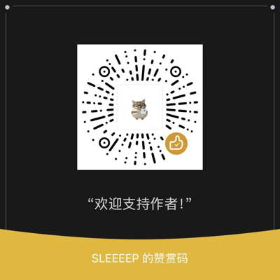

# 🔬 AI4科研 智能体 · 科研日常事务助手

> 10 个开箱即用的科研日常 AI 智能体：论文写作、图表规范、基金、答辩、选刊、引用、统计与组会。

```bash
git clone https://github.com/qgeng1465/ai4research-agents.git
cd ai4research-agents
python install.py            # 安装全部到全局 agents 目录
```

## ✨ 特性

- ✅ **零配置**：每个智能体是单个 Markdown 文件，含完整专业工作流
- ✅ **即装即用**：`python install.py` 一键装到 AI 助手的全局 agents 目录，任意项目都能 `@调用`
- ✅ **AI4科研**：论文润色 / 降重 / 实验记录 / 图表规范 / 基金标书 / 答辩 PPT / 选刊 / 引用管理 / 统计 / 组会汇报
- ✅ **跨平台**：Windows / macOS / Linux 通用
- ✅ **原创实现**：全部智能体为本项目独立编写

## 🚀 快速开始

### 前置条件
- 已安装支持 Markdown 智能体（agents）的 AI 编程助手
- 已安装 Python 3.9+（用于安装器）

### 安装

```bash
git clone https://github.com/qgeng1465/ai4research-agents.git
cd ai4research-agents
python install.py            # 安装全部 10 个
python install.py --list     # 先看有哪些
```

### 使用

在你的 AI 编程助手会话中直接输入：

```
@citation-manager 文献引用整理…
@defense-ppt 开题/中期/毕业答辩 PPT…
@figure-spec 科研图表规范…
```

也可以手动安装：把 `agents/*.md` 复制到你所用的 AI 助手全局 agents 目录
（`install.py` 会自动定位该目录，无需手动查找）。

## 📦 智能体列表（10 个）

| 智能体 | 能力 |
|-------|------|
| `@citation-manager` | 文献引用整理：把引用列表按格式（GB/T 7714/APA/MLA/Vancouver）规范化、去重、核对 DOI，输出可粘贴的引用表。用法：粘贴引用列表或 DOI。 |
| `@defense-ppt` | 开题/中期/毕业答辩 PPT：按研究内容产出每页标题、要点、图表建议与答辩讲稿、常见提问准备。用法：给我课题名称与研究内容。 |
| `@figure-spec` | 科研图表规范：检查并改进图片/图表格式（分辨率、字号、色彩、误差线、图例），符合目标期刊要求。用法：给我图表描述或图文件信息。 |
| `@grant-writing` | 基金/标书写作：立项依据、研究内容与方案、创新点、研究基础、预算编制，符合国内基金写作规范。用法：给我研究方向与背景。 |
| `@group-meeting` | 组会汇报：把本周/阶段工作整理成组会汇报提纲（进展/数据/问题/求助），生成汇报要点与讲解话术。用法：粘贴本周工作内容。 |
| `@journal-finder` | 期刊推荐与投稿选刊：按研究方向/影响力/开放获取/审稿周期推荐候选期刊，给出投稿建议。用法：给我论文主题与目标档次。 |
| `@lab-notebook` | 实验记录整理：把零散/手写的实验记录整理成规范的电子实验记录（目的/材料/步骤/原始数据/结果/结论）。用法：粘贴实验记录。 |
| `@paper-polish` | 学术论文润色：中式英文/语病/时态/术语/逻辑衔接优化，输出润色稿与修改说明，可指定期刊风格。用法：粘贴段落或全文。 |
| `@paper-revise` | 论文降重与改写：对重复率高的段落做同义改写、结构调整、句式变换，保留原意与科学信息。用法：粘贴需改写的段落。 |
| `@stats-helper` | 科研统计助手：选对检验方法、给出 SPSS/Python 代码、解读结果并给出论文报告语句。用法：描述数据类型与研究设计。 |

## 🔧 定制智能体服务

需要**专属定制**的智能体？可以把需求发到我邮箱或评论区，支持按你的课题、行业、业务定制。本项目会持续更新更多智能体。

## ⚠️ 免责声明

本仓库提供的智能体**仅用于学习研究及个人合理使用**。
- 学术写作与降重请遵守所在机构学术规范，不得用于学术不端；统计结论请结合专业复核。
- 各智能体的输出不保证完全准确，请结合专业知识与原始数据复核。
- 请遵守您所在国家/地区的法律法规、各平台服务条款及学术规范，尊重版权与隐私。
- 使用本项目产生的任何风险与法律责任由使用者自行承担。

## ☕ 支持作者

如果这些智能体帮到了你，欢迎扫码赞赏支持，让我有动力持续更新～



## 📄 License

[MIT](./LICENSE) © 2026 qgeng1465
